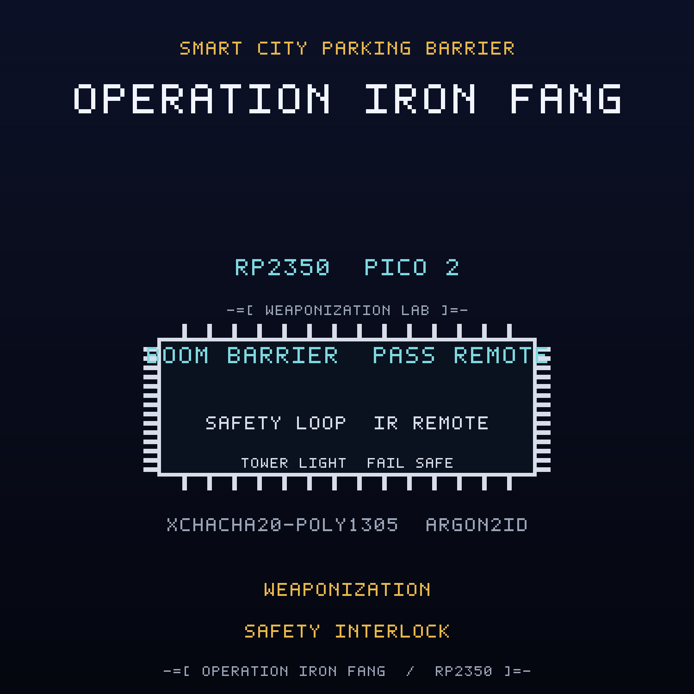

<br>

## FREE Reverse Engineering Self-Study Course [HERE](https://github.com/mytechnotalent/reverse-engineering)
## FREE Embedded Hacking Course [HERE](https://github.com/mytechnotalent/Embedded-Hacking)

<br>

# OPERATION IRON FANG CTF

### Act IX - The compromised smart city parking barrier

<br>

***
**LEGAL DISCLAIMER:**
The information, tools, and code provided in this repository and course are strictly for educational, research, and defensive purposes only. 

You are explicitly prohibited from using any materials contained herein to access, test, modify, or exploit any device, network, or system that you do not own 100% or for which you do not have explicit, documented, and legally binding authorization to interact with.

By using this repository and course, you acknowledge and agree that:

1. Any illegal, unauthorized, or malicious use of this information is solely your responsibility.
2. The author(s) and contributor(s) of this repository and course shall not be held liable for any damages, legal repercussions, criminal charges, or unauthorized actions resulting from the use, misuse, or abuse of the contents herein.
3. You will comply with all applicable local, state, national, and international laws regarding cybersecurity and computer fraud.

**IF YOU DO NOT AGREE WITH THESE TERMS, DO NOT USE THIS REPOSITORY AND COURSE.**
***

<br>
<br>

> Hello again, friend.
>
> Act I was the lie. Act II was the door. Act III was the payload. Act IV was the
> payload that would not die. Act V was the payload that spreads. Act VI was the
> payload that steals. Act VII was the payload that takes orders. Act VIII was the
> payload that holds the building hostage. This is the payload that becomes a
> weapon.
>
> WHITEOUT broke the padlock and cleared the marker, and for a shift the hall
> cooled again. But a payload that learns to hold a building can learn to swing a
> gate. The Ministry did not need a fleet that obeys and it did not need a building
> that cannot breathe. It needed a boom that comes down hard on command, and it
> already owned the arm that lifts it.
>
> The smart parking barrier is the gate a city trusts with its lanes. A boom raises
> to grant a pass. A monthly-pass remote asks for a raise. A cabinet temperature
> sensor watches the enclosure for heat. A parking control gateway authorizes a
> pass, a raise, or a lower. That is the whole contract, and it is a good one.
>
> FROSTLINE's implant in this one does not spread, does not steal, and does not take
> orders. It weaponizes the actuator. It ignores the safety loop and slams the boom
> down on a magic command, turning a gate into a physical hazard, and it writes a
> weapon marker into the reserved sector with the real flash API so the weapon
> re-arms after a reflash. This is physical weaponization wrapped in control logic:
> the device withholds safety from the machine it exists to move.
>
> The green lamp still says OPEN while the boom is being held down. The LCD still
> reports a state, and the state is a lie it was told to repeat. Underneath, the
> lane is being controlled by a weapon with a polite label.
>
> Do not chase the symptoms one at a time. Disarm the boom slam. Restore the safety
> interlock. Clear the weapon marker. Then seal the barrier command path so no pass
> or lower command can ever be forged, and make the barrier fail safe to the raised
> posture when the link is lost.
>
> The lane is clear and the boom is falling. That is exactly the problem.

This is the companion capture-the-flag to the
[smart-parking-barrier](https://github.com/mytechnotalent/smart-parking-barrier)
project. Where the project builds the defended node, this CTF hands you the
**compromised** image that FROSTLINE shipped and asks you to find every defect,
prove it on real hardware, and patch the image.

<br>

## THE MISSION

The `ACT-IX.bin` image is the OPERATION IRON FANG smart parking barrier with **four
deliberate defects**. Each defect is an in-place, same-size byte patch, so no
address moves when you fix it. Every fix is provable on a Pico 2 with a Debug
Probe.

| # | Name | What FROSTLINE did |
| - | ---- | ------------------ |
| 1 | The Boom Slam | inverted the weapon gate so the implant reports the boom armed, forces the boom down, and slams the boom on the magic command `IRON-FANG-SLAM-2026` |
| 2 | The Safety Mask | inverted the mask gate so the safety loop falsely reports clear while the weapon holds the barrier |
| 3 | The Weapon Marker | inverted the marker gate so the first boot programs weapon marker `0x57` into reserved sector `0x103FF000` with the real flash API |
| 4 | The Barrier Command Authorization | inverted the authorization verdict so an unauthenticated or replayed barrier command is accepted |

The wire is sealed with XChaCha20-Poly1305, keyed through Argon2id. The cryptography
is correct. Three of the four defects are not in the cipher at all: they are a
weapon that slams the boom down, masks its own safety interlock, and writes a
durable weapon marker to the reserved sector. The fourth is a policy seam in the
barrier command path. The weapon never needs the cipher. It sits beside the
authenticated link and overrides the output, so a perfectly valid raise command can
arrive and the boom will still slam down. Read the dead, find the weapon, and take
it away.

<br>

## THE ARTIFACTS

| File | Role | SHA-256 |
| ---- | ---- | ------- |
| `ACT-IX.bin` | compromised firmware, the target | `e38aed5dfeaeeb09dbfba75d52a0d95f035656acd35c923ee67991830c87fc9e` |
| `ACT-IX.uf2` | flashable image of the target | `03a1b13a0e3a5102c8b090466b6b2b3acaa54769ea668b0a6d244f67c2b79071` |
| `ACT-IX_fixed.bin` | corrected firmware, the solution | `c0dc50f73c753dd216010ecfcb147eb7af2ff7c1d49af217f7abd3dea7f75f3e` |
| `ACT-IX_fixed.uf2` | flashable image of the solution | `4c2a861885073ad4bee7a19d1cf2113ae4858207ccc42ffc071b24a111b2ed39` |

The two `.bin` files differ in exactly four bytes at offsets
`0x7529, 0xA295, 0xA2AD, 0xA2EF`, and both are 50,460 bytes. The UF2 images are
101,888 bytes.

<br>

## THE DOCUMENTS

| Document | For |
| -------- | --- |
| [`ACT-IX-I.md`](ACT-IX-I.md) | Student instructions: the scenario, the tasks, the wiring |
| [`ACT-IX-R.md`](ACT-IX-R.md) | Requirements and grading criteria |
| [`ACT-IX-S.md`](ACT-IX-S.md) | Instructor solution key with exact offsets and bytes |
| [`ACT-IX-main-disasm.txt`](ACT-IX-main-disasm.txt) | Annotated disassembly of the four sabotage sites |
| [`DESIGN.md`](DESIGN.md) | Build blueprint (instructor eyes only) |

<br>

## HARDWARE

Everything runs on the Embedded Hacking breadboard, and the pin map is identical to
Acts I to VIII so one board serves the whole foundation: a Pico 2, a Debug Probe, a
DHT11 cabinet temperature sensor on GP4, a 1602 I2C LCD barrier readout on GP2/GP3
at address `0x27`, three tower light lamps (red GP16 DENIED, yellow GP17 PASS
PENDING, green GP18 OPEN), a manual raise button on GP15, an SG90 boom barrier servo
on GP14 with a 1000uF cap, a VS1838B infrared monthly-pass remote on GP5, and an
RYLR998 LoRa parking control link on UART1 GP8/GP9. The Debug Probe is effectively
required: the anti-debug trap is part of the exercise. The pin map is in the
instructions.

The cryptographic model is carried over from the earlier acts: Argon2id (`t=3`,
`p=1`, `m=64`) derives the field key, XChaCha20-Poly1305 seals every barrier
command, and the anti-replay sequence window and authenticated-state tag are reused
unchanged. The weapon is compiled only under `SANDBOX_ONLY`, which the CTF build
defines.

<br>

## QUICK START

Verify the two images against the expected patches and hashes:

```bash
python3 scripts/verify_ctf.py
```

Expected:

```text
10/10 checks passed
```

Build the corrected firmware from source:

```bash
rm -rf build && cmake -S . -B build -G Ninja -DPICO_BOARD=pico2 -DPICO_PLATFORM=rp2350-arm-s -DSANDBOX_ONLY=ON && cmake --build build
```

Run the firmware code standard audit:

```bash
python3 scripts/audit_c_standard.py
```

<br>

## REPOSITORY LAYOUT

```text
ACT-IX-I.md              student instructions
ACT-IX-R.md              requirements and grading criteria
ACT-IX-S.md              instructor solution key
ACT-IX.bin / .uf2        compromised artifact
ACT-IX_fixed.bin / .uf2  corrected artifact
ACT-IX-main-disasm.txt   annotated sabotage sites
scripts/verify_ctf.py    machine verifier
scripts/spoof.py         forged and replayed command injection
src/  include/           firmware sources
CMakeLists.txt           Pico SDK build
DESIGN.md                build blueprint
```

<br>

## WHERE THIS FITS: OPERATION COLD IRON

This is the companion CTF for **Act IX (IRON FANG)** of the ten-act OPERATION COLD
IRON saga. The malware track began in Act III; in Act IV it became persistence, in
Act V it became propagation, in Act VI it became exfiltration, in Act VII it became
command and control, in Act VIII it became availability and lockout logic, and here
it becomes physical weaponization. Act IX is the act that teaches why a device can
turn its own actuator into a hazard, why a masked safety interlock is a
physical-safety failure, and why the defense is a policy and a build control, not a
cipher. The project it attacks is
[smart-parking-barrier](https://github.com/mytechnotalent/smart-parking-barrier).

- Previous act: Act VIII, IRON VAULT, the datacenter vent controller,
  [datacenter-vent-controller](https://github.com/mytechnotalent/datacenter-vent-controller)
- This act: Act IX, IRON FANG, the smart parking barrier
- Next act: Act X, IRON CURTAIN, chemical-warning-terminal

<br>

## THE MINISTRY

The Ministry runs the state: the surveillance, the cold chain, the gates, the
pipelines, the air, the cabinets that hold what the state does not discuss, the
lockers that move it, the factories that make it, the buildings that keep the
record, and the lanes that decide who passes. NorthPharma is one of its deniable
industrial fronts, and FROSTLINE is the contractor that does the work no Ministry
letterhead will admit to. FROSTLINE did not break into this node; it built the
weapon, taught it to slam the boom, staged the weapon marker in a reserved sector,
and signed the image. Against them is WHITEOUT, and the engineer who copied the
first image, NIGHTINGALE. This act is one gate on the Ministry's smart-city edge.
TELESCREEN, the surveillance backbone that watches it, comes after the ten.

- Project repository: [github.com/mytechnotalent/smart-parking-barrier](https://github.com/mytechnotalent/smart-parking-barrier)
- This CTF repository: [github.com/mytechnotalent/CTF_smart-parking-barrier](https://github.com/mytechnotalent/CTF_smart-parking-barrier)

<br>

# Next
[OPERATION IRON CURTAIN](https://github.com/mytechnotalent/chemical-warning-terminal)

<br>

# License
[MIT License](https://github.com/mytechnotalent/CTF_smart-parking-barrier/blob/main/LICENSE)
